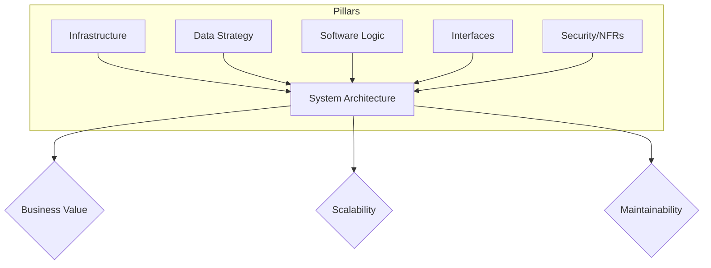

# Introduction to System Architecture

## What is System Architecture?

Architecture is the high-level structuring of a system that defines its components, their relationships, and the principles guiding its design and evolution. While software engineering often focuses on *how* a feature is built, architecture focuses on the **decisions that are difficult or expensive to change later.**

An architect's role is to bridge the gap between business goals and technical execution. This involves navigating the "Grey Area"—making choices where there is no single "correct" answer, only a set of trade-offs that satisfy specific functional and non-functional requirements.

> **The Architect’s Mantra:** "Every choice is a trade-off. If you can’t see the downside of your architecture, you haven’t looked hard enough."

## Why is System Architecture Important?

Without a deliberate architecture, systems tend toward **Entropy**—a state of increasing disorder where new features become harder to ship and bugs become harder to fix.

* **Managing Complexity:** It breaks monolithic problems into manageable, decoupled components.
* **Technical Debt Mitigation:** Proper design prevents "painting yourself into a corner" with technologies that cannot scale or evolve.
* **Stakeholder Alignment:** It provides a visual and conceptual language that allows developers, product owners, and executives to agree on the system’s direction.
* **Operational Predictability:** By defining Non-Functional Requirements (NFRs) like reliability and latency early, you avoid "firefighting" after the system goes live.

---

## Key Pillars of System Architecture

Modern architecture isn't just about servers and code; it's a stack of five interconnected pillars:

1. **Infrastructure & Environment**: The foundation, whether physical hardware or cloud-virtualized resources (compute, storage, and VPCs).
2. **Data Strategy**: How information is persisted, indexed, and synchronized across relational and non-relational stores.
3. **Software Components**: The logic, patterns (e.g., Microservices, Event-Driven), and languages used to process business rules.
4. **Interfaces & Integration**: The "contracts" between systems, including REST/gRPC APIs, message queues, and user interfaces.
5. **Cross-Cutting Concerns**: Security, observability, and compliance measures that must permeate every layer of the stack.

## References

1. **Aras.** (2026). *System Architecture Glossary.* Retrieved from [https://aras.com/en/glossary/system-architecture](https://aras.com/en/glossary/system-architecture)
2. **Pareek, K.** (2025). *Architecture of a System.* GeeksforGeeks. Retrieved from [https://www.geeksforgeeks.org/system-design/architecture-of-a-system/](https://www.geeksforgeeks.org/system-design/architecture-of-a-system/)
3. **Richards, M., & Ford, N.** (2020). *Fundamentals of Software Architecture.* (Reference for "Hard Parts" and Trade-offs).